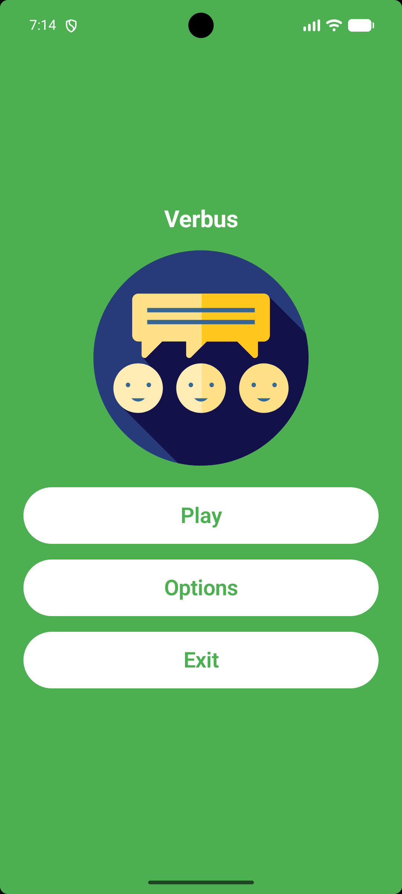
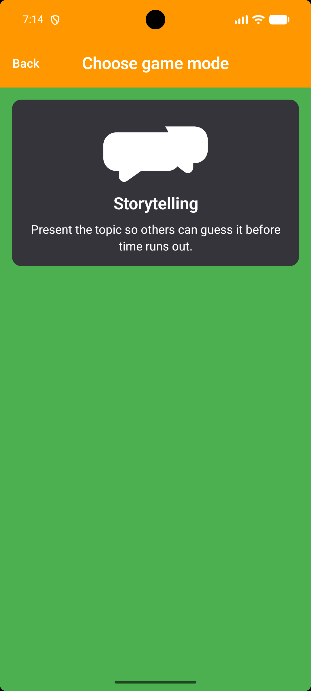
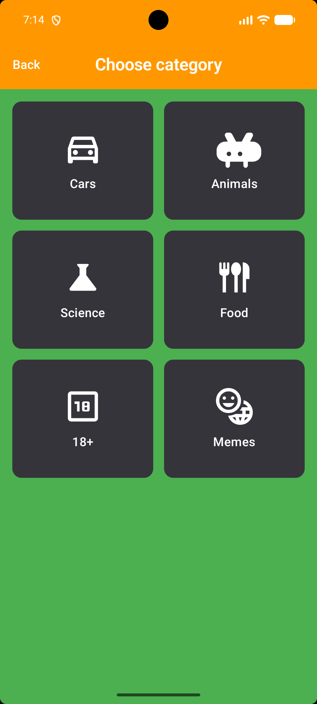
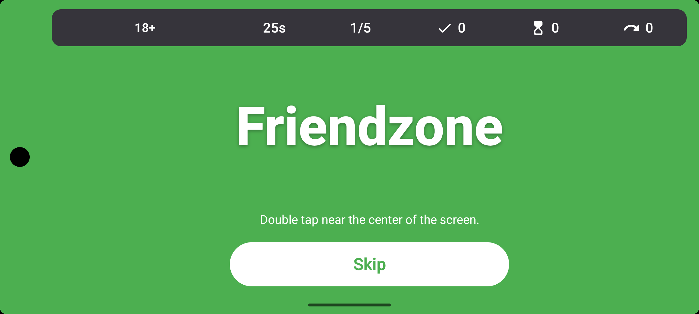
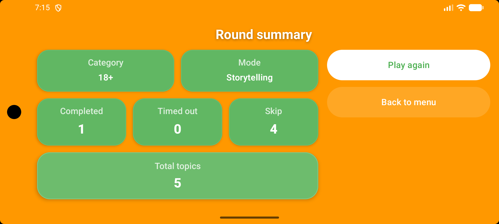

# Verbus

Verbus is an offline Android word guessing game built with Kotlin and Jetpack Compose.

License: **MIT**. See [LICENSE](LICENSE).

## Screenshots

<p align="center">
  
  
  
  
</p>

<p align="center">
  
  
</p>

## Current state

- one playable mode: **Storytelling / Opowiadanie**
- built-in categories: **Cars**, **Animals**, **Science**, **Food**, **Memes**, **+18**
- offline-only content loaded from `assets/`
- settings stored in DataStore
- active round state and topic history stored in Room
- UI languages: Polish and English
- configurable theme colors
- configurable completion signal: **double tap**, **shake**, or **button**
- configurable sound sets with fallback to built-in procedural sounds

## Recent updates

- fixed double-tap sound feedback so the feedback sound can be played consistently across the gameplay surface, while the round-completion logic still remains constrained to the intended gameplay area
- added text shadows in the main menu, options, and shared UI text components to improve readability on high-contrast or even intentionally bad color combinations such as white text on a white background
- strengthened sound availability fallback so missing or unavailable sound-set files can fall back to pre-rendered built-in procedural sounds more reliably
- cleaned up minor UI code leftovers during the same pass

## Build

Requirements:

- Android Studio
- JDK 17

Commands:

```bash
./gradlew assembleDebug
./gradlew testDebugUnitTest
```

Minimum Android version: **API 26**.

## Editable content

### Categories index

`app/src/main/assets/categories/categories.txt`

Format:

```text
category_id|file_name|polish name|english name|optional drawable resource name
```

Example:

```text
cars|cars.txt|Samochody|Cars|ic_category_cars
animals|animals.txt|Zwierzęta|Animals|ic_category_animals
science|science.txt|Nauka|Science|ic_category_science
food|food.txt|Jedzenie|Food|ic_category_food
```

### Topic files

`app/src/main/assets/topics/*.txt`

Format:

```text
stable_id|polish text|english text
```

Example:

```text
car_001|Ferrari|Ferrari
car_002|Samochód elektryczny|Electric car
```

### Sound sets

`app/src/main/assets/soundsets/<set_id>/`

The app auto-detects folders inside `assets/soundsets/` and exposes them in **Options > Sounds**.

Supported filenames per event (first matching file wins):

```text
tap.*
single_tap.*
double_tap.*
button_press.*
topic_success.*
topic_skip.*
topic_timeout.*
round_success.*
round_failure.*
```

Supported extensions:

```text
ogg
mp3
wav
m4a
```

Missing files are allowed. When a sound is unavailable, the app falls back to built-in procedural sounds.

## How to add a new category

1. Create a new UTF-8 file in `app/src/main/assets/topics/`, for example `movies.txt`.
2. Add topics in the format `stable_id|pl|en`.
3. Add a new line to `app/src/main/assets/categories/categories.txt`.

Example:

```text
movies|movies.txt|Filmy|Movies|ic_category_movies
```

4. If the category should have an icon:
   - add the drawable to `app/src/main/res/drawable/`
   - register it in `previewDrawableMap` in `app/src/main/java/io/github/verbus/ui/components/CommonComponents.kt`
   - if it is a monochrome vector that should follow theme tinting, also add it to `isMonochromeVector(...)` in the same file
5. Rebuild the app.

Without the `CommonComponents.kt` mapping, the drawable name from `categories.txt` will not be shown in the UI.

## How to add topics to an existing category

Append new lines to the correct file in `app/src/main/assets/topics/`.

Rules:

- one topic per line
- unique `stable_id` within that file
- UTF-8 encoding
- no empty required fields

## How to add a custom sound set

1. Create a new folder in `app/src/main/assets/soundsets/`, for example `retro/`.
2. Add one or more supported sound files using the event filenames listed above.
3. Rebuild the app.
4. Select the sound set in **Options > Sounds**.

You do not need to provide every sound file. Partial sound packs are valid.

## Validation rules used by the app

- lines starting with `#` are treated as comments
- blank lines are ignored
- malformed lines are skipped
- duplicate category IDs are skipped
- duplicate topic IDs inside one file are skipped
- a category is not playable if its topic file is missing or if no valid topics remain after parsing
- a category with fewer than 5 valid topics still works, but logs a warning

## Other files you may need to edit

### UI translations

- `app/src/main/res/values/strings.xml`
- `app/src/main/res/values-pl/strings.xml`

### Main content-related code

- `app/src/main/java/io/github/verbus/data/content/TopicFileParser.kt`
- `app/src/main/java/io/github/verbus/data/content/AssetContentRepository.kt`
- `app/src/main/java/io/github/verbus/ui/components/CommonComponents.kt`
- `app/src/main/java/io/github/verbus/app/ProceduralSoundPlayer.kt`

## Notes

- topic history is used to reduce repeats between rounds
- the current repeat block window is 8 hours
- active round state is restored after app resume or relaunch
- the project is designed to work fully offline during gameplay

## Safe follow-up improvements

- add regression checks for tap, double-tap, shake, and button completion signals
- audit and remove any unused resources after each UI/content pass
- consider a small asset-integrity startup check for optional developer builds to catch missing sound files earlier
- review unusual typography scale constants in shared UI components before further polishing passes
